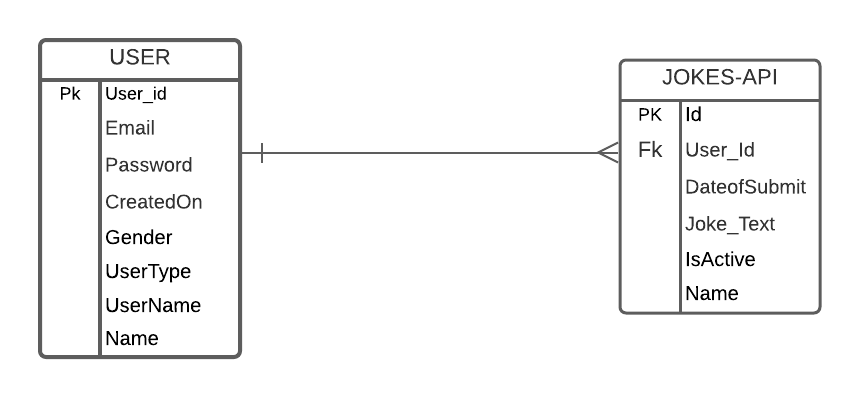

### Project Title
### Smile Maker

## Objective
This app shows up a joke every time when the user opens it. The user can login, submit and edit a joke as it's a user-friendly app. It is multi-responsive and easy to handle. Smile maker is the prograssive web app, that helps to see the joke which are loaded from the global api. And one custom api which will be used to add or edit his/her own jokes using his/her login's.

### Team Members
1. Manoj Nuvvala
2. Sai Kiran Reddy Enugala

### Schedule & Sprints for the application development
- Sprint 1
    - Gather all the requirements for developement.
    - Design sketches for UI pages.
    - Setup for the backend development.
    - Decide the tables for the Database Design.
- Sprint 2
    - Models for the Database.
    - UI pages for all the screens.
    - API's for implementing functionalities.
    - Test views for code complexity.
- Sprint 3
    - Code reviews and code refactoring.
    - Test cases for all the api's.
    - Integrate backend api's with frontend pages.
    - Manual tests after integration(Both backend and frontend).
- Spring 4
    - Deployment setup for the application.
    - Host application in the browser.
    - Release application for the first time.
    - Review application for the final time.

- Schedule & sprints are set by the GDP semesters (about every 2-weeks = a sprint)
- Budget is set by the size of the development team * average expected hours per developer per week
- Scope of work should be clearly divided into sprint buckets of time

### Budget

| Team Member                   | Cost per hour | Cost per week | Roles                  |
| ----------------------------- | ------------- | ------------- | ---------------------- |
| Manoj Nuvvala                 | 30$           | 1200$         | Backend                |
| Sai Kiran Reddy Enugula       | 30$           | 1200$         | Frontend               |

### Technology Stack
- Backend language + framework: Python, Flask
- Backend free app host: Heroku
- Data host + type: SQLite/MySQL
- Front-end page plan: server-side views
- Front-end responsive design: Bootstrap

## Entities

### User
     - Email
     - Password
     - CreatedOn
     - Gender
     - UserType
     - UserName
     - Name

### Jokes-Api
    - UserName
    - DateOfSubmit
    - Joke_Text
    - IsActive
    - Name
### ER Diagram

